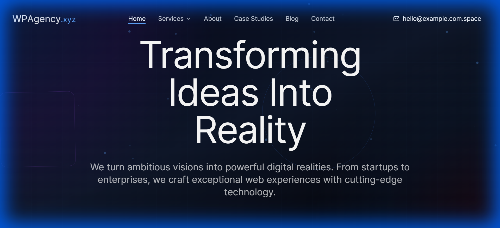

# React Source Seeker

An interactive storytelling template with Three.js 3D effects, PWA support, and Supabase integration.

[](./LICENSE)
[](https://react.dev)
[](https://threejs.org)
[](https://www.framer.com/motion)
[](https://supabase.com)
[](https://web.dev/progressive-web-apps)
[](https://vitejs.dev)
[](https://tailwindcss.com)
[](https://www.typescriptlang.org)



> **[Live Demo →](https://source-seeker.wpagency.space)**

## Features

- **Three.js 3D effects and scenes** - Stunning 3D graphics and interactive environments
- **Framer Motion advanced animations** - Powerful sequencing and gesture-driven animations
- **Supabase backend integration** - Open-source Firebase alternative with PostgreSQL
- **PWA with offline support** - Progressive Web App capabilities for offline functionality
- **Interactive storytelling components** - Engaging narrative components with rich interactions
- **Portfolio and case study sections** - Beautiful templates for showcasing work
- **Blog with rich content** - Full-featured blog system with categories and tags
- **Contact forms with validation** - Accessible forms with comprehensive validation
- **Dark gradient design aesthetic** - Modern, premium visual design language
- **Progressive enhancement** - Works across all devices with graceful degradation
- **Netlify deployment ready** - Pre-configured for seamless Netlify deployment

## Quick Start

```bash
# Clone the repository
git clone https://github.com/wpagency/react-source-seeker.git

# Navigate to the project
cd react-source-seeker

# Install dependencies
npm install

# Start development server
npm run dev
```

Open [http://localhost:5173](http://localhost:5173) in your browser.

## Tech Stack

| Technology | Purpose |
|-----------|---------|
| React 18.3.1 | UI framework with hooks and concurrent features |
| Three.js 0.176.0 | 3D graphics library for WebGL rendering |
| Framer Motion 12.12.1 | Advanced animation and gesture library |
| Supabase 2.50.0 | Open-source Firebase alternative with PostgreSQL |
| Vite 6.3.5 | Next-generation frontend build tool |
| Tailwind CSS 3.4.11 | Utility-first CSS framework with typography plugin |
| React Router v6 | Client-side routing for single-page application |
| TypeScript 5.5.3 | Typed superset of JavaScript |
| TanStack Query | Server state management and caching |
| React Hook Form + Zod | Form validation and management |

## Project Structure

```
react-source-seeker/
├── src/
│   ├── components/        # UI components and layouts
│   ├── pages/             # Route pages (Home, Blog, Portfolio, etc.)
│   ├── three/             # Three.js scenes and components
│   ├── hooks/             # Custom React hooks
│   ├── lib/               # Utility functions and helpers
│   ├── types/             # TypeScript definitions
│   ├── services/          # Supabase client and API calls
│   └── App.tsx            # Main application component
├── public/                # Static assets and screenshots
├── index.html             # HTML entry point
├── vite.config.ts         # Vite configuration
├── tailwind.config.ts     # Tailwind CSS theme config
├── netlify.toml           # Netlify deployment configuration
└── tsconfig.json          # TypeScript configuration
```

## Environment Variables

Copy `.env.example` to `.env.local` and fill in your Supabase credentials:

```bash
cp .env.example .env.local
```

See [.env.example](./.env.example) for all available options.

Required environment variables:
- `VITE_SUPABASE_URL` - Your Supabase project URL
- `VITE_SUPABASE_ANON_KEY` - Your Supabase anonymous key

## Scripts

| Command | Description |
|---------|------------|
| `npm run dev` | Start development server with hot reload |
| `npm run build` | Build for production with optimizations |
| `npm run preview` | Preview production build locally |
| `npm run lint` | Run ESLint to check code quality |
| `npm run type-check` | Check TypeScript types |

## Customization

### Colors and Theme

Edit the dark gradient color palette in `tailwind.config.ts` or `src/index.css` to match your brand. The theme uses rich gradients and premium typography:

```tsx
// Example: Customizing theme
export const colors = {
  primary: 'from-purple-600 to-blue-600',
  secondary: 'from-pink-500 to-red-500',
  dark: 'from-gray-900 to-black',
};
```

### 3D Scenes

Modify or create new 3D components in `/src/three`. Customize lighting, geometry, and materials:

```tsx
import { Canvas } from '@react-three/fiber';

export function ThreeScene() {
  return (
    <Canvas>
      <mesh>
        <sphereGeometry args={[1, 32, 32]} />
        <meshStandardMaterial color="#ff6b6b" />
      </mesh>
      <ambientLight intensity={0.5} />
      <pointLight position={[10, 10, 10]} />
    </Canvas>
  );
}
```

### Animations

Use Framer Motion for smooth transitions and interactions. Update animation variants in components:

```tsx
import { motion } from 'framer-motion';

export function StaggeredList({ items }) {
  const container = {
    hidden: { opacity: 0 },
    visible: {
      opacity: 1,
      transition: { staggerChildren: 0.1 },
    },
  };

  return (
    <motion.ul variants={container} initial="hidden" animate="visible">
      {items.map(item => <motion.li key={item}>{item}</motion.li>)}
    </motion.ul>
  );
}
```

### Content and Blog

Update blog posts and portfolio projects. Store content in Supabase or as markdown files in `/src/content/`:

```tsx
// Fetch blog posts from Supabase
export async function getBlogPosts() {
  const { data } = await supabase
    .from('blog_posts')
    .select('*')
    .order('published_at', { ascending: false });
  return data;
}
```

## Netlify Deployment

The project includes a `netlify.toml` configuration for seamless deployment:

```bash
# Deploy to Netlify
npm run build
# Push to your Git repository
# Netlify will automatically build and deploy
```

Environment variables should be set in your Netlify dashboard under Site Settings > Build & Deploy > Environment.

## PWA Setup

The project includes PWA capabilities. To enable:

1. Ensure `manifest.json` is properly configured in `/public/`
2. Service workers are automatically generated by Vite PWA plugin
3. Add to home screen functionality works on iOS 16.4+ and Android

## Other Themes in This Collection

| Theme | Description | Demo |
|-------|------------|------|
| [Astro Brutalfolio](https://github.com/wpagency/astro-brutalfolio) | Brutalist multilingual portfolio | [Demo](https://brutalfolio.wpagency.space) |
| [Astro Romance](https://github.com/wpagency/astro-romance) | Romantic pink agency theme | [Demo](https://astro-romance.wpagency.space) |
| [Astro Starter](https://github.com/wpagency/astro-starter) | Full-featured Astro starter with Three.js | [Demo](https://astro-starter.wpagency.space) |
| [React Agency Genesis](https://github.com/wpagency/react-agency-genesis) | Premium agency funnel template | [Demo](https://agency-genesis.wpagency.space) |
| [React Parallax Foundry](https://github.com/wpagency/react-parallax-foundry) | 3D parallax website with R3F | [Demo](https://parallax-foundry.wpagency.space) |
| [React Pulse Robot](https://github.com/wpagency/react-pulse-robot) | WordPress showcase with Lottie | [Demo](https://pulse-robot.wpagency.space) |
| [React Rescue Odyssey](https://github.com/wpagency/react-rescue-odyssey) | Story-driven space theme with Supabase | [Demo](https://rescue-odyssey.wpagency.space) |

## Contributing

Contributions are welcome! Please see [CONTRIBUTING.md](./CONTRIBUTING.md) for guidelines.

## License

MIT License — see [LICENSE](./LICENSE) for details.

---

### Built by [WP Agency](https://wpagency.xyz) — WordPress and Beyond

With 15+ years of agency experience, we build production websites that perform. These open-source themes represent our commitment to the developer community.

**Need customization or a production build?** [Let's talk →](https://wpagency.xyz/contact)
